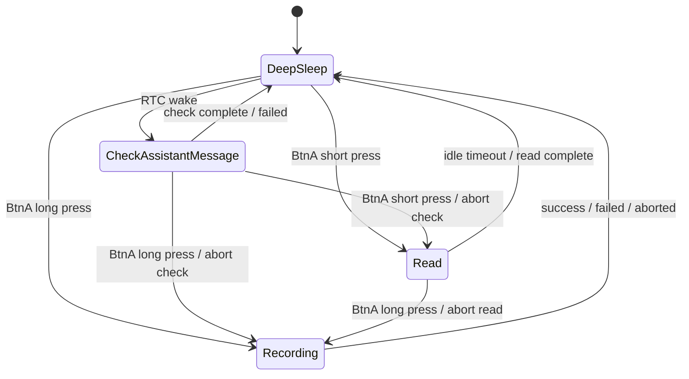
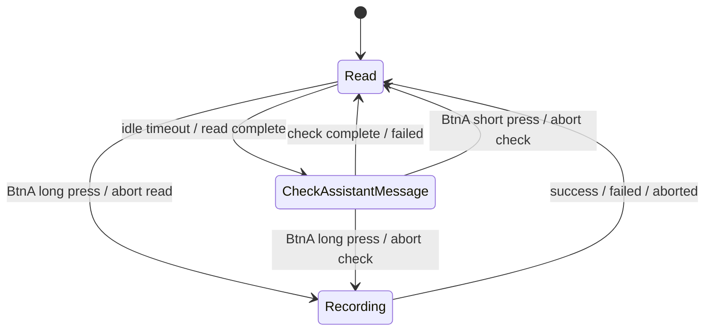

# Zero Buddy

Firmware for a small AI voice companion designed specifically for the
M5StickS3 ESP32-S3 device.

Zero Buddy records raw microphone audio, sends PCM bytes to Zero's
transcription API, sends the recognized text to a Zero chat thread, polls that
thread for assistant replies, stores unread assistant messages in LittleFS, and
renders them on the device screen.

## Hardware

- Target board: M5StickS3 / ESP32-S3-PICO-1N8R8
- Display: 1.14" StickS3 LCD
- Power: battery, VBUS, and charging state are sampled through M5Unified
  `M5.Power` APIs; external power detection uses the M5PM1 SDK power-source
  bits.
- Input:
  - BtnA short press: open `Read`
  - BtnA long press: open `Recording`
  - G12 / BtnB press: cycle five persisted backlight levels, then off
  - Side Reset short press: restart
  - Side Reset long press for 2 seconds: clear runtime provisioning config and restart
- Status LED reflects whether LittleFS currently has unread assistant messages.

## Core Modes

The firmware has four business modes:

- `DeepSleep`
  - Unplugged idle state.
  - Checks charging before sleep preparation.
  - If unplugged, configures RTC wake, BtnA wake, turns the screen off,
    disconnects Wi-Fi, and enters ESP32 deep sleep.
  - If plugged, returns to `Read` without configuring RTC wake.
- `CheckAssistantMessage`
  - Connects Wi-Fi if needed, polls the Zero thread from `lastMessageId`,
    appends new assistant messages to LittleFS, and updates polling backoff.
- `Read`
  - Turns on the screen and lets the user read stored assistant messages.
  - BtnA short press scrolls and advances messages.
  - When all messages are read, it clears assistant message storage and LED.
  - A 15 second idle timeout completes the mode.
- `Recording`
  - Turns on the screen, records up to the configured capture window, transcribes
    raw PCM, sends the user message, updates `lastMessageId`, resets check delay,
    shows success/failure for 5 seconds, then returns to the state machine.

Unplugged flow:



Plugged flow:



Plugged operation does not schedule RTC wake. The device stays in the foreground
`Read -> CheckAssistantMessage -> Read` loop until external power is removed.

## Provisioning

Normal builds do not require secrets at compile time. Runtime configuration is
stored in NVS namespace `zero_runtime`:

- `wifi_ssid`
- `wifi_password`
- `auth_token`
- `thread_id`
- `backlight`

Setup is BLE-first:

1. Open `https://bb0.ai` in Google Chrome.
2. Connect to the advertised `Zero-Buddy-xxxx` device through Web Bluetooth.
3. The page writes Wi-Fi credentials to the device over BLE.
4. BLE stops after Wi-Fi is configured.
5. The device requests a device code over HTTPS and shows it on screen.
6. Approve the device code on `bb0.ai`.
7. The device polls for the approved token/thread and persists them to NVS.

BLE discovery uses service UUID:

```text
bb000001-8f16-4b2a-9bb0-000000000001
```

The info characteristic is:

```text
bb000002-8f16-4b2a-9bb0-000000000001
```

Advertising only exposes coarse setup state and non-sensitive flags. Tokens,
thread ids, poll tokens, and device codes are not advertised.

## Optional Compile-Time Defaults

For a pre-provisioned build, copy the template:

```sh
cp src/secrets.example.h src/secrets.h
```

Then fill any optional macros:

```cpp
#define ZERO_BUDDY_WIFI_SSID ""
#define ZERO_BUDDY_WIFI_PASSWORD ""
#define ZERO_BUDDY_PAT ""
#define ZERO_BUDDY_THREAD_ID ""
```

Runtime Wi-Fi in NVS takes precedence over compile-time Wi-Fi. Compile-time PAT
and thread id, when provided, take precedence over older NVS auth/thread values.

`src/secrets.h` is ignored by git. Do not commit real credentials.

## Build, Test, Flash

Install PlatformIO, then run:

```sh
pio test -e native
pio run -e m5stack-sticks3
pio run -e m5stack-sticks3 -t upload
```

The default serial port pattern is configured in `platformio.ini`:

```text
/dev/cu.usbmodem*
```

If your device appears on a different port, update `platformio.ini` or pass the
port through PlatformIO.

macOS example:

```sh
pio run -e m5stack-sticks3 -t upload --upload-port /dev/cu.usbmodem1143301
```

Serial monitor:

```sh
pio device monitor -e m5stack-sticks3
```

## GitHub Firmware Releases

Every commit pushed to `main` runs the firmware release workflow:

1. Run native unit tests.
2. Build the `m5stack-sticks3` firmware.
3. Package flashable ESP32-S3 images.
4. Publish a GitHub Release tagged `firmware-<short-sha>`.

The release contains `firmware.bin` plus a zip package with:

- `bootloader.bin`
- `partitions.bin`
- `boot_app0.bin`
- `firmware.bin`
- `firmware.elf`
- `FLASHING.txt`

GitHub-hosted runners cannot access a local USB device, so the workflow
publishes flashable firmware artifacts rather than physically flashing a desk
device. To flash a downloaded release package manually, install `esptool` and
follow the command in `FLASHING.txt`.

## State Storage

- RTC memory:
  - `currentMode`
  - `checkDelayMs`
  - `lastMessageId`
  - `hasAssistantMessage`
  - `lastRenderScreenState`
- LittleFS:
  - assistant message files
  - assistant queue/read progress manifest
  - temporary raw PCM recording file
- NVS:
  - runtime Wi-Fi, auth token, and thread id
  - `lastMessageId` cursor bound to the current thread id, so cold restarts can
    continue assistant polling without re-sending a voice message

`lastRenderScreenState` is only a screen renderer cache. Business modes must not
read it for state transitions.

## Project Layout

- `src/main.cpp`: hardware orchestration, provisioning, mode wiring
- `src/screen_renderer.*`: semantic screen rendering and render cache
- `lib/zero_buddy_state`: hardware-independent shared state helpers
- `lib/zero_buddy_modes`: mode lifecycle implementations
- `lib/zero_buddy_core`: parsing and pure helper functions
- `docs/state.md`: full state model
- `docs/boot-preflight.md`: startup/provisioning flow
- `docs/modes/*.md`: mode-specific lifecycle notes
- `test/*`: native Unity tests
