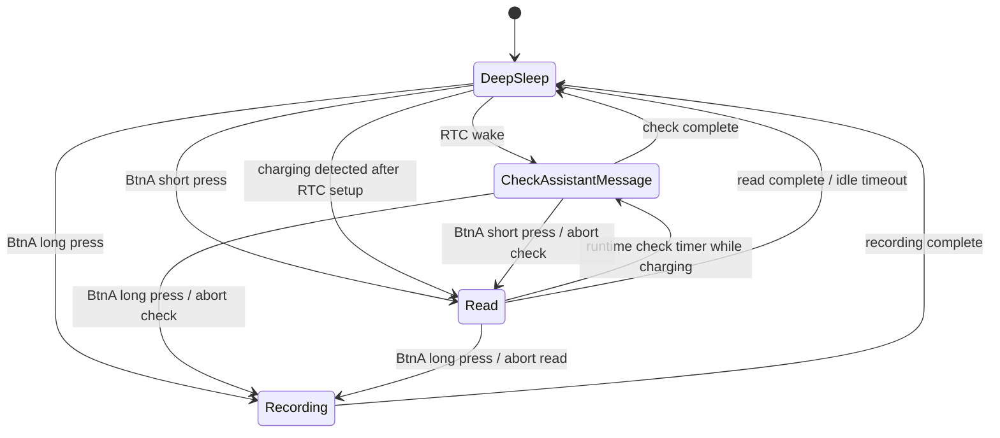

# Firmware State Design

This document describes the core state design for the rewritten AI voice assistant firmware. It covers mode transitions, lifecycle behavior, and the mode-owned rendering that affects state flow.

## Core Modes

The rewritten firmware starts with four core modes:

- `DeepSleep`
  - The device is in deep sleep.
  - Only required wake sources are enabled, such as the RTC timer and BtnA.
  - RTC wake transitions to `CheckAssistantMessage`.
  - BtnA short press transitions to `Read`.
  - BtnA long press transitions to `Recording`.
  - After scheduling the next RTC wake, if charging is detected, it schedules a runtime assistant-check timer and transitions directly to `Read` instead of hibernating.

- `CheckAssistantMessage`
  - Checks whether the assistant has a new message or notification.
  - This is a short-lived task mode.
  - After the check completes, it automatically transitions back to `DeepSleep`.
  - If BtnA short press is detected during the check, the check is aborted before entering `Read`.
  - If BtnA long press is detected during the check, the check is aborted before entering `Recording`.

- `Recording`
  - Handles audio recording.
  - Entered from `DeepSleep`, `CheckAssistantMessage`, or `Read` via BtnA long press.
  - After recording completes, it automatically transitions to `DeepSleep`.
  - Includes transcription, user message sending, cursor update, and check backoff reset.

- `Read`
  - Lets the user read stored assistant messages.
  - Entered from `DeepSleep` via BtnA short press.
  - Turns the screen on, sets the CPU to a display-safe frequency, and renders either the current assistant message or an empty state.
  - BtnA short press scrolls the current message, then advances through later messages until everything is read.
  - BtnA long press aborts reading before entering `Recording`.
  - If it was entered from the charging path, the runtime assistant-check timer can abort reading before entering `CheckAssistantMessage`.
  - When reading completes or idles out, it transitions back to `DeepSleep`.

## Lifecycle Contract

Each mode exposes two lifecycle methods:

- `enter(context)`
  - Mode entry point.
  - Initializes resources, tasks, timers, or peripherals required by the mode.
  - Must assume the previous mode has already exited or been aborted.

- `abort(reason)`
  - Interrupts the mode while it is running.
  - Stops in-flight work and releases resources owned by the mode.
  - Must be idempotent: repeated calls must not crash, double-free resources, or corrupt state.
  - After `abort` finishes, the state machine decides the next mode.

All transitions are driven by the state machine. A mode must not directly mutate the global current mode. A mode may return a completion result or abort reason, and the state machine performs the next transition.

## Global Hardware Controls

- BtnB is a global runtime control.
  - A short BtnB press restarts the firmware with `esp_restart()`.
  - Holding BtnA while pressing BtnB clears runtime provisioning config before
    restarting. This clears Wi-Fi, auth token, thread id, local message cursor,
    and assistant message files.
  - A plain BtnB restart is not a mode transition and does not mutate persistent
    global state.
  - Runtime loops that wait on user input, Wi-Fi, transcription, status/result display, or the boot splash should poll BtnB.
  - Deep sleep wake remains owned by the configured RTC timer and BtnA wake source.

## Global State

The first rewrite keeps a small global state surface. Global state is reserved for data that must survive across modes or across RTC wake cycles.

```cpp
enum class Mode {
  DeepSleep,
  CheckAssistantMessage,
  Read,
  Recording,
};

struct GlobalState {
  Mode currentMode;

  uint32_t checkDelayMs;
  char lastMessageId[160];

  bool hasAssistantMessage;
  RenderScreenState lastRenderScreenState;
};
```

- `currentMode`
  - Tracks the active firmware mode.
  - Only the state machine updates this field.

- `checkDelayMs`
  - Stores the next RTC wake delay for `CheckAssistantMessage`.
  - Uses exponential backoff capped at 1 hour.
  - `CheckAssistantMessage` updates it after each check.
  - A successful assistant message check or a completed user recording can reset it to the initial delay.

- `lastMessageId`
  - Stores the message id used as the next `sinceId` when checking assistant messages.
  - `Recording` writes it after successfully sending the user's message, using the returned user `messageId`.
  - `CheckAssistantMessage` writes it after polling, using the newest message id it has observed.
  - This state is global because both modes advance the same message cursor.

- `hasAssistantMessage`
  - Boolean presence flag for stored assistant messages.
  - It only records whether LittleFS currently has at least one assistant message.
  - It is maintained by `append_assistant_message` and `clear_assistant_message`, not directly by mode logic.

- `lastRenderScreenState`
  - Tracks the last full-screen render key so mode transitions can avoid drawing the same screen again.
  - Cleared when the screen is turned off.
  - Local overlays, such as the top-right battery icon, are not part of this key.
  - Zero avatar dialogue screens share a stable shell: background, avatar,
    bubble frame, and bubble tail.
  - When moving between two dialogue-bubble screen kinds, the renderer should
    keep that shell and redraw only the bubble's interior content whenever the
    layout has not changed.
  - Examples include `Boot`, `ReadEmpty`, all `Recording*` status screens,
    `SetupWifi`, `SetupDeviceCode`, and `SetupStatus`.
  - Current full-screen render kinds:
    - `Boot`
    - `ReadEmpty`
    - `ReadAssistantMessage`
    - `RecordingPrompt`
    - `RecordingActive`
    - `RecordingWifi`
    - `RecordingTranscribing`
    - `RecordingSending`
    - `RecordingSent`
    - `RecordingAborted`
    - `RecordingFailed`
    - `SetupWifi`
    - `SetupDeviceCode`
    - `SetupStatus`

Mode-local state, such as audio buffers, network request handles, temporary file handles, and abort flags, should stay inside the owning mode instead of being added to `GlobalState`.

## Persistent Storage

Some global state is also persisted because the device spends most of its time in deep sleep.

- RTC memory
  - `checkDelayMs`
  - `lastMessageId`
  - `hasAssistantMessage`
  - `lastRenderScreenState`
  - validation magic/version

- LittleFS
  - assistant message files
  - assistant queue metadata used internally by the storage helpers
    - message count
    - current read message index
    - current read message `scrollTop`
  - temporary recording or network response files, if a mode needs them internally

`CheckAssistantMessage` owns appending assistant messages through `append_assistant_message`. `Recording` owns clearing assistant messages before a new user turn through `clear_assistant_message`. `Read` owns read progress updates and also clears assistant messages through `clear_assistant_message` after the final stored assistant message has been fully read. The assistant LED is not controlled directly by modes; it is updated inside the append/clear helpers so it reflects whether LittleFS currently has assistant messages.

- NVS namespace `zero_runtime`
  - `wifi_ssid`
  - `wifi_password`
  - `auth_token`
  - `thread_id`
  - These are runtime provisioning values, not compile-time firmware constants.

Wi-Fi provisioning status is split between BLE advertising and GATT:

- Advertising exposes only coarse state and non-sensitive flags for discovery.
- GATT info characteristic JSON is the source of truth while BLE Wi-Fi setup is
  active.
- After Wi-Fi is received, BLE is stopped before device-code auth begins.
- `api_token`, `thread_id`, `poll_token`, and `device_code` are never
  advertised. Token approval is polled by the device over HTTPS.

## Transitions

The core flow is:



## Event Rules

- `RtcWake`
  - Only valid in `DeepSleep`.
  - Calls `DeepSleep.abort("rtc_wake")`, then `CheckAssistantMessage.enter()`.

- `BtnALongPress`
  - Starts recording from `DeepSleep`.
  - Aborts the check and starts recording from `CheckAssistantMessage`.
  - Aborts reading and starts recording from `Read`.
  - No additional behavior is defined in `Recording` yet.

- `BtnAShortPress`
  - Starts `Read` from `DeepSleep`.
  - Aborts the check and starts `Read` from `CheckAssistantMessage`.
  - Inside `Read`, this is handled by the mode to scroll the current assistant message or advance to the next assistant message.

- `ChargingDetected`
  - Only valid in `DeepSleep`.
  - Fired after `DeepSleep` schedules the RTC wake.
  - Starts a runtime assistant-check timer using the same `checkDelayMs`.
  - Transitions directly to `Read` instead of entering ESP32 deep sleep.

- `CheckDue`
  - Valid while `Read` is being used as the foreground charging mode.
  - Aborts `Read` with `check_due`, clears the runtime assistant-check timer, and enters `CheckAssistantMessage`.

- `CheckComplete`
  - Only valid in `CheckAssistantMessage`.
  - Transitions to `DeepSleep`.

- `ReadComplete`
  - Only valid in `Read`.
  - Transitions to `DeepSleep`.

- `RecordingComplete`
  - Only valid in `Recording`.
  - Transitions to `DeepSleep`.

## Transition Procedure

A transition follows a fixed sequence:

1. The current mode receives an event.
2. The state machine decides whether the event can trigger a transition.
3. If the current mode must be interrupted, call its `abort(reason)`.
4. Update the current mode.
5. Call the new mode's `enter(context)`.

`CheckAssistantMessage -> Read`, `CheckAssistantMessage -> Recording`, `Read -> CheckAssistantMessage`, and `Read -> Recording` require an explicit mid-flight abort. The check may be performing network work, so it must call `abort("btn_a_short_press")` before entering `Read` or `abort("btn_a_long_press")` before entering `Recording`. Read may be waiting for user input or holding file/display resources, so it also aborts first.

## Initial Scope

The first rewrite pass does not cover:

- Battery UI.
- Animation and beep feedback.
- Test modes.
- Complex polling backoff.

These capabilities can be added later as separate modules connected to the state machine, but they should not pollute the core mode flow.
