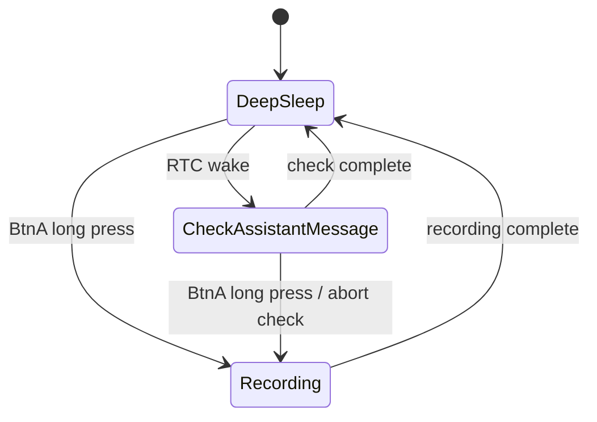

# Firmware State Design

This document describes the core state design for the rewritten AI voice assistant firmware. At this stage, it only covers mode transitions and lifecycle behavior. Screen wake, rendering, animation, and battery UI are intentionally out of scope.

## Core Modes

The rewritten firmware starts with three core modes:

- `DeepSleep`
  - The device is in deep sleep.
  - Only required wake sources are enabled, such as the RTC timer and BtnA.
  - RTC wake transitions to `CheckAssistantMessage`.
  - BtnA long press transitions to `Recording`.

- `CheckAssistantMessage`
  - Checks whether the assistant has a new message or notification.
  - This is a short-lived task mode.
  - After the check completes, it automatically transitions back to `DeepSleep`.
  - If BtnA long press is detected during the check, the check is aborted before entering `Recording`.

- `Recording`
  - Handles audio recording.
  - Entered from `DeepSleep` or `CheckAssistantMessage` via BtnA long press.
  - After recording completes, it automatically transitions to `DeepSleep`.
  - Whether ASR and message sending are part of the `Recording` exit flow will be defined in a later design pass.

## Lifecycle Contract

Each mode exposes two lifecycle methods:

- `enter(context)`
  - Mode entry point.
  - Initializes resources, tasks, timers, or peripherals required by the mode.
  - Must assume the previous mode has already exited or been aborted.

- `abort(reason)`
  - Interrupts the mode while it is running.
  - Stops in-flight work and releases resources owned by the mode.
  - Must be idempotent: repeated calls must not crash, double-free resources, or corrupt state.
  - After `abort` finishes, the state machine decides the next mode.

All transitions are driven by the state machine. A mode must not directly mutate the global current mode. A mode may return a completion result or abort reason, and the state machine performs the next transition.

## Global State

The first rewrite keeps a small global state surface. Global state is reserved for data that must survive across modes or across RTC wake cycles.

```cpp
enum class Mode {
  DeepSleep,
  CheckAssistantMessage,
  Recording,
};

struct GlobalState {
  Mode currentMode;

  uint32_t checkDelayMs;
  char lastMessageId[160];

  bool hasAssistantMessage;
};
```

- `currentMode`
  - Tracks the active firmware mode.
  - Only the state machine updates this field.

- `checkDelayMs`
  - Stores the next RTC wake delay for `CheckAssistantMessage`.
  - Uses exponential backoff capped at 1 hour.
  - `CheckAssistantMessage` updates it after each check.
  - A successful assistant message check or a completed user recording can reset it to the initial delay.

- `lastMessageId`
  - Stores the message id used as the next `sinceId` when checking assistant messages.
  - `Recording` writes it after successfully sending the user's message, using the returned user `messageId`.
  - `CheckAssistantMessage` writes it after polling, using the newest message id it has observed.
  - This state is global because both modes advance the same message cursor.

- `hasAssistantMessage`
  - Boolean presence flag for stored assistant messages.
  - It only records whether LittleFS currently has at least one assistant message.
  - It is maintained by `append_assistant_message` and `clear_assistant_message`, not directly by mode logic.

Mode-local state, such as audio buffers, network request handles, temporary file handles, and abort flags, should stay inside the owning mode instead of being added to `GlobalState`.

## Persistent Storage

Some global state is also persisted because the device spends most of its time in deep sleep.

- RTC memory
  - `checkDelayMs`
  - `lastMessageId`
  - `hasAssistantMessage`
  - validation magic/version

- LittleFS
  - assistant message files
  - assistant queue metadata used internally by the storage helpers
  - temporary recording or network response files, if a mode needs them internally

`CheckAssistantMessage` owns appending assistant messages through `append_assistant_message`. `Recording` owns clearing assistant messages through `clear_assistant_message`. The assistant LED is not controlled directly by modes; it is updated inside those helpers so it reflects whether LittleFS currently has unread assistant messages.

## Transitions

The core flow is:



## Event Rules

- `RtcWake`
  - Only valid in `DeepSleep`.
  - Calls `DeepSleep.abort("rtc_wake")`, then `CheckAssistantMessage.enter()`.

- `BtnALongPress`
  - Starts recording from `DeepSleep`.
  - Aborts the check and starts recording from `CheckAssistantMessage`.
  - No additional behavior is defined in `Recording` yet.

- `CheckComplete`
  - Only valid in `CheckAssistantMessage`.
  - Transitions to `DeepSleep`.

- `RecordingComplete`
  - Only valid in `Recording`.
  - Transitions to `DeepSleep`.

## Transition Procedure

A transition follows a fixed sequence:

1. The current mode receives an event.
2. The state machine decides whether the event can trigger a transition.
3. If the current mode must be interrupted, call its `abort(reason)`.
4. Update the current mode.
5. Call the new mode's `enter(context)`.

`CheckAssistantMessage -> Recording` is the only transition that currently requires an explicit mid-flight abort. The check may be performing network work, so it must call `abort("btn_a_long_press")` before entering `Recording`.

## Initial Scope

The first rewrite pass does not cover:

- Screen wake, sleep, or rendering.
- Assistant message display styling.
- Battery UI.
- Animation and beep feedback.
- Test modes.
- Complex polling backoff.

These capabilities can be added later as separate modules connected to the state machine, but they should not pollute the core mode flow.
